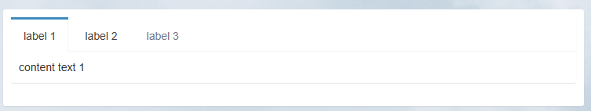
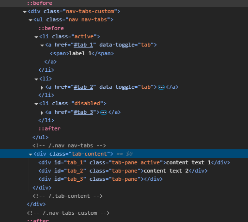
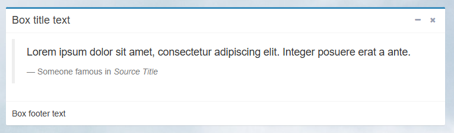

# Yii2 widgets

Набор виджетов для yii2 на базе yii\bootstrap4\Widget

## Installation

```bash
composer require --prefer-dist denisok94/yii2-widgets
# or
php composer.phar require --prefer-dist denisok94/yii2-widgets
```

## Use

- [NavTabs](#NavTabs)
- [Box](#Box)
- [BlokFiles](#BlokFiles)

## NavTabs




```php
use denisok94\yii2\widgets\NavTabs;
echo NavTabs::widget(['tabs' => [
    '1' => [
        'label' => 'label 1',
        'content' => 'content  text 1',
    ],
    '2' => [
        'label' => 'label 2',
        'content' => 'content text 2',
    ],
    '3' => [
        'label' => 'label 3',
        'content' => 'content 3',
        'disabled' => true
    ],
 //...
]])
echo NavTabs::widget(['tabs' => [
    'overview' => [
        'label' => 'Обзор',
        'content' => $this->render('_overview', [
            'model' => $model,
        ])
    ],
    'story' => [
        'label' => 'История',
        'content' => $this->render('_story', [
            'model' => $model,
        ])
    ],
    'outfit' => [
        'label' => 'Одежда',
        'content' => $this->render('_outfit', [
            'model' => $model,
        ]),
        'disabled' => true
    ],
]]);
```

## Box



```php

use denisok94\yii2\widgets\Box;

<?php Box::begin([
    'type' => 'primary', // solid / default / primary / success / warning / danger / info
    'title' => 'Box title text',
    'footer' => 'Box footer text', // or ~ $this->render('_footer', ['model' => $model])
    'collapse' => true, // show button collapse
    'remove' => true, // show button remove
]); ?>
<!-- box body ↓ -->
<blockquote>
    <p>Lorem ipsum dolor sit amet, consectetur adipiscing elit. Integer posuere erat a ante.</p>
    <small>Someone famous in <cite title="Source Title">Source Title</cite></small>
</blockquote>
<?php Box::end(); ?>
```

## BlokFiles

Базовая горизонтальная группировка (тест)

```php
use denisok94\yii2\widgets\BlokFiles;
echo BlokFiles::widget([
 'items' => $items, 
 'options' => [
     'a' => [], // or 'div' => [],
     'img' => [], 
     'span' => []]
]);
```
options a/img:

```php
$options = [
     'url' => '/app/',
     'key' => 'id', // items->id
]; // url + key
$options = [
     'url' => '/app/${key}.png',
     'key' => 'id', // items->id
     'parse' => true,
]; // url/key.png
```

options span: `['key' => 'id', // items->id]`.

base yii html options add `['options' => []]`.

```php
use denisok94\yii2\widgets\BlokFiles;
echo BlokFiles::widget([
 'items' => $items, 
 'callback' => function ($action, $item, $key) {
     return $action = 'img' ? 'url1' : 'url2';
  },
]);
```

location full
```php
use denisok94\yii2\widgets\BlokFiles;
echo BlokFiles::widget([
 'items' => $items, 
 'options' => [
     'a' => [
         'url' => '/app/',
         'key' => 'id', // items->id
     ], 
     'img' => [
         'url' => '/app/${key}.png',
         'key' => 'id', // items->id
         'parse' => true,
     ],
     'span' => [
         'key' => 'name', // items->name
     ], 
 ]
]);
```